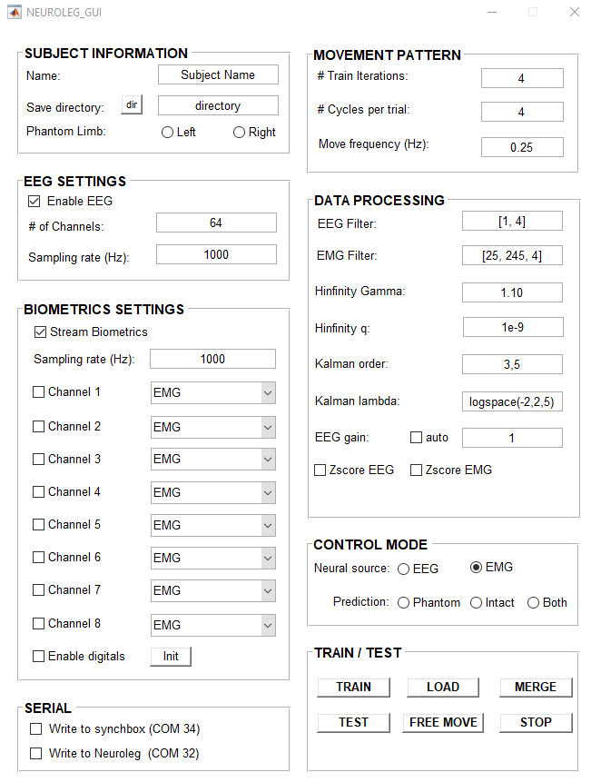

# NEUROLEG - An EEG-based BMI for closed-loop control (Kalman filter) of an external prosthesis/end effector

For part of my PhD dissertation project, I developed a real-time EEG-based brain-machine interface that was used by lower limb amputees to control a custom powered-knee prosthesis. We recruited several below-the-knee amputees to participate in a two part study: an offline study that used EEG, EMG, IMU-based motion capture, and fMRI to study the representation of the phantom limb, and a second study that focused on EEG-based closed-loop control. This was an exciting project and we hope to publish the detailed protocol and results soon! This repo provides the source code for the real-time EEG-based BMI. Some of the main features are:

## Main Features
- Real time streaming into MATLAB:
    * EEG from BrainAmp DC (Brain Products GmbH)
    * Goniometers and EMG from Biometrics DataLOG (The data don't actually matter. The streaming is the same for any inputs to the device.)
    * IMUs using an OPAL system (APDM)
- A MATLAB-based OOP implementation of:
    * Kalman filter class for linear and unscented implementations (formulation based off of paper by [Li et al, 2009](https://journals.plos.org/plosone/article?id=10.1371/journal.pone.0006243)) 
    * Kernel ridge regression w/a RBF kernel
- A simple but useful PID controller in Arduino/Teensy
- An example for using Arduino/Teensy to sync multiple systems

## Overview
Here is a basic overview of the experiment/program:

- The subject was instrumented with EEG, EMG, IMUs, and goniometers. 
- They were seated in front of a monitor where they performed a series of movement tasks according to the cues and timing presented on the screen. These included movements of the intact and phantom knee and bilateral hand movements as a control. 
- For realtime experiments, the subject performed a series of training trials where they followed the path of the moving dot. 
- A Kalman filter was trained to predict the position of their limb from the EEG and EMG signals.
- The subjects were given a few trials to perform EMG-control of the device. 
- After several trials, the control was shifted from EMG to EEG control.

### Screenshot of GUI
<p align="center">
   
<p> 

## Directory structure
The real-time interface was developed using MATLAB since several of the key components were already written there. The main GUI is `/rtc/NEUROLEG_GUI.m`, which was used to set up the experiment parameters and call all of the required functions. 

```bash   
.
├── _inprogress           # Functions currently in progress
├── dependencies          # Contains a few dependencies. Some may be unneeded but needs to be double checked
├── images                # Images/videos. Mostly for demonstration purposes
├── misc                  # Contains EEG montage
├── ...
├── rtc                                                # CONTAINS ALL THE CODE FOR REAL TIME CONTROL (RTC)
│   ├── NEUROLEG_GUI.fig                               # Figure file for MATLAB GUI - built with GUIDE
│   ├── NEUROLEG_GUI.m                                 # Main GUI for running real time 
│   ├── Neuroleg_Movement_Demo.m                       # Demo file
│   ├── Neuroleg_PIDcontrol_JB                         # PID control in Arduino for leg prosthesis
│   ├── Neuroleg_RTControl_Demo.m                      # Demo file RTC
│   ├── XBee_TriggerBox_MAIN_PsychtoolboxProtocol_JB   # Arduino code for trigger box used to sync systems
│   ├── ...
│   └── neuroleg_gui_functions                         # RTC CODE CALLED BY NEUROLEG_GUI
├── ...
└── utils                                              # CONTAINS KALMAN FILTER, BW FILTER, CLEANING FUNCTIONS, ETC..
```
   
## Real time functions called by GUI
For clarity, I want to break down a few of the folders in more detail. After running `/rtc/NEUROLEG_GUI.m`, the following scripts are called in order:

```bash   
.
├── ...
├── rtc
│   ├── ...
│   └── neuroleg_gui_functions 
│       └── ... description below ...
```

|No.| Function      | Purpose | Notes     |
|:-| :---        |    :----   |         :--- |
|1| `neuroleg_realtime_setup`      | Defines defaults     | Used to fill defaults when opening GUI; sets all filter params    |
|2| `neuroleg_realtime_params2handles`      | Set defaults     | Puts defaults into handles to pass around GUI |
|3|`neuroleg_realtime_parsehandles`      | Unpacks defaults     |  Parses handles; called in training and testing   |
|4| `build_movement_fig`      | Builds movement figure | Calls `WindowAPI` for positioning window    |
|5| `neuroleg_realtime_stream`      | Streams data   | Initalizes streaming from all devices; run for each leg - used to get training data  |
|6| `neuroleg_realtime_train`      | Trains prediction model | Uses streamed data to build Kalman filter for EEG and EMG prediction of movement (`./utils/KalmanFilter/`)
|7| `neuroleg_realtime_control`      | Real time control, baby!   | Calls 3-5 then uses trained model from 6 to control leg. Shows stimulus movement pattern  |
|8| `neuroleg_realtime_freemove`      | Free movement RTC | Calls 3-5 then uses trained model from 6 to control leg. Does not provided stimulus. Allows for continuous unconstrained control. 

## Additional useful/necessary functions for real-time control and offline analysis
   
In addition to the real time control functions used by the GUI, there are a number of scripts in the `./utils` folder that are used in real time and can be used for offline:

|No.| Function      | Purpose | Notes     |
|:-| :---        |    :----   |         :--- |
|1| `KalmanFilter.`      | Linear and unscented Kalman Filter   | Training, grid-search parameter optimization, and prediction |
|2| `KernelRidgeRegression`      | Ridge regression w/RBF kernel   | Training, grid-search parameter optimization, and prediction |
|3| `Orientation_Estimation`      | Orientation estimation from IMUs  | Used w/OPAL system for orientation estimation |
|4| `align_data`      | Data alignment  | Given data and markers perform alignment |
|5| `biometrics_datalog`      | MATLAB class for Biometrics DataLOG  | Used to initialize and stream data from Biometrics via `OnLineInterface64.dll` |
|6|  `blindcolors` | Color blind colors | Colorblind friendly colors from [Points of view: Color blindness](https://www.nature.com/articles/nmeth.1618) |
|7| `hinfinity` | EEG artifact removal | Used for real-time and offline artifact removal of ocular artifacts. [See original paper](https://iopscience.iop.org/article/10.1088/1741-2560/13/2/026013/pdf)|
|8| `filterdata` | zero-phase filtering | Mainly used for offline analysis to implement zero-phase Butterworth filter |
|9| `loadBiometrics` | Load Biometrics data offline | Used for offline analysis |
|10| `loadOpal` | Load OPAL data offline | Used for offline analysis not real time streaming |
|11| `make_ss_filter` | state-space BW filter | Gets state-space implementation Butterworth filter. Real-time compatible causal filter for sample-by-sample filtering.| 
|12| `use_ss_filter` | use state-space filter | Apply state-space filter from `make_ss_filter` to data |
|12| `readcaptrak` | read Brainvision `.bvct` file | Used to parse the XML format `.bvct` files from Brainvision captrak system |
|13| `resampledata` | Resample two time series | Resample one time series to another given their sampling rates | 
|14| `rescale_data` | Rescale data | Rescale data between two values | 


### Example of the offline experiments where the subject is moving the intact limb:

<video width="50%" loop autoplay controls src="https://user-images.githubusercontent.com/22403383/159746338-ea9febbc-a2d1-4504-a2ab-f951ec210ce0.mp4" type="video/mp4">
    Your browser does not support the video tag.
</video>

### Example of the subject moving the phantom limb. Notice the small movements of the stump. 

<video width=500 loop autoplay controls src="https://user-images.githubusercontent.com/22403383/159745693-2a565167-ee54-4d81-925e-2f6627f1f075.mp4" type="video/mp4">
    Your browser does not support the video tag.
</video>


